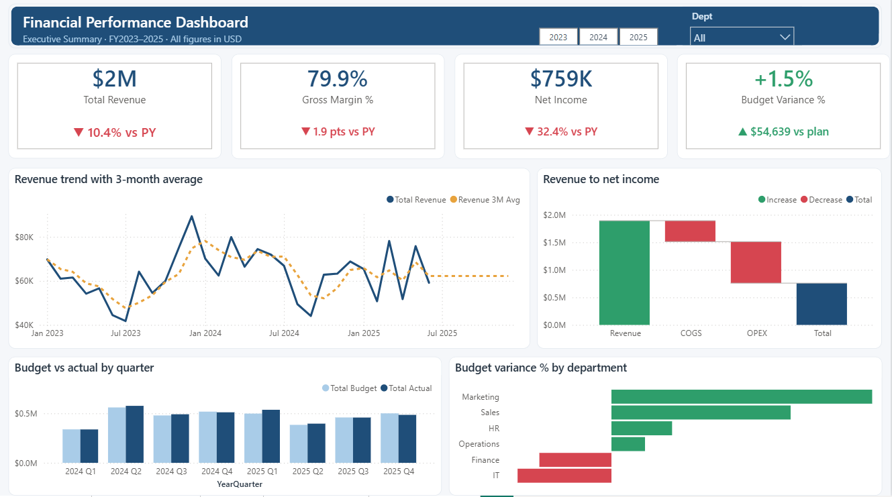
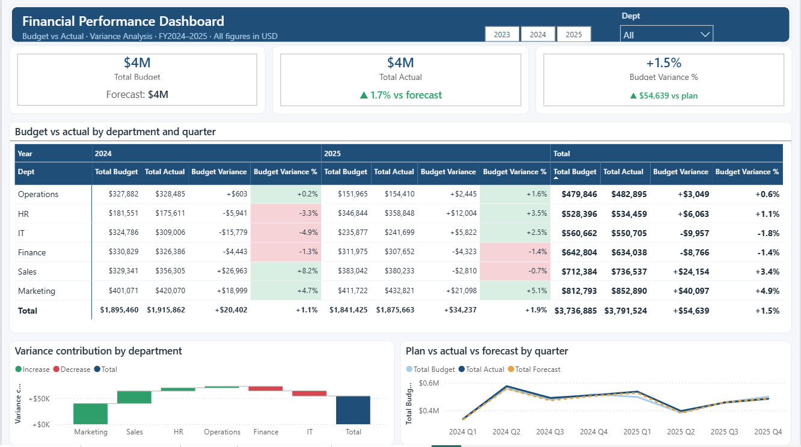
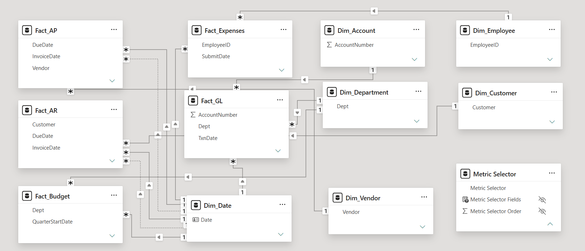
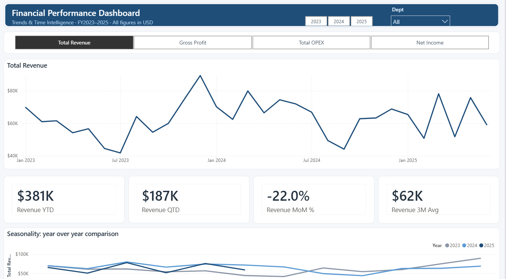
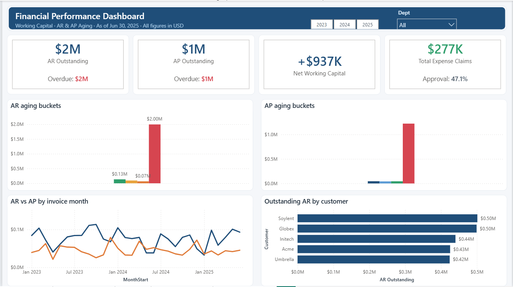

# Corporate Financial Performance & Budget Variance Dashboard

**Power BI | FP&A Analytics | Star Schema | 40+ DAX Measures**

An end-to-end financial planning & analysis (FP&A) dashboard built in Power BI Desktop — from raw multi-currency Excel exports to an executive-ready decision tool covering P&L performance, budget variance, time intelligence, and working capital.



---

## The problem this solves

Finance teams spend days each month rebuilding the same reports in Excel: consolidating ledgers, converting currencies by hand, reconciling budget files, and emailing static screenshots to department heads. By the time the pack lands, the numbers are already stale — and nobody can drill into *why* a variance happened.

This dashboard replaces that cycle with a single interactive model that answers, in seconds:

- Where are we against plan — by department, by quarter, by account?
- What is driving the variance, and is it favorable or unfavorable?
- How is performance trending year over year, on a like-for-like basis?
- How much cash is tied up in receivables, and how much of it is overdue?

---

## What's inside

| Page | Purpose | Key techniques |
|---|---|---|
| **Executive Summary** | One-screen health check: revenue, margin, net income, variance to plan | KPI cards with trend indicators, waterfall P&L bridge, 3-month moving average |
| **Budget vs Actual** | The FP&A core: variance analysis down to department × quarter | Conditional-formatted matrix, variance waterfall, plan/actual/forecast comparison |
| **Trends & Time Intelligence** | Dynamic metric exploration across time | **Field parameter** (switch metric on the fly), YTD/QTD/MoM, seasonality overlay |
| **Working Capital** | Liquidity risk: AR/AP aging and collection exposure | Aging buckets, AR vs AP trend, top-debtor ranking, **drillthrough to invoice level** |



---

## Data model

Eleven tables in a clean star schema — five fact tables surrounded by six conformed dimensions, with `Dim_Date` as the single time backbone (marked as a date table; all time intelligence flows through it).



**Fact tables:** General Ledger (2,000 rows) · Budget/Forecast (48) · Accounts Payable (800) · Accounts Receivable (900) · Expense Claims (1,000)

**Dimensions:** Date · Account · Department · Vendor · Customer · Employee

**Design decisions:**
- Single-direction filtering from dimensions to facts — no ambiguity, no bidirectional performance tax
- Two inactive relationships on `DueDate` (AP/AR), reserved for due-date-based aging analysis
- Auto date/time disabled; one purpose-built calendar replaces 10 hidden auto-generated tables

---

## Engineering highlights

### Multi-currency normalization
The source data mixes USD, EUR, GBP, CAD, and AUD with **no exchange rate table**. Summing it as-is produces meaningless totals — a mistake any finance reviewer would catch immediately. An FX rate table was built in Power Query and merged into every fact table, producing a single trusted `AmountUSD` column that all measures are built on.

### Fair year-over-year comparison
The dataset ends mid-2025. A naive YoY comparison pits six months of 2025 against a full 2024 year and reports a catastrophic **−51.2%** — technically computed, completely wrong.

The fix anchors the comparison window to the last date with actual data:

```dax
Revenue PYTD =
VAR MaxData = [Last Data Date]
VAR DatesCapped = FILTER(VALUES(Dim_Date[Date]), Dim_Date[Date] <= MaxData)
RETURN CALCULATE([Revenue YTD], DATEADD(DatesCapped, -1, YEAR))
```

Like-for-like result: **−10.4%**. Same data, honest answer. This is the difference between rendering charts and doing financial analysis.

### Aging anchored to the reporting date
AR/AP aging buckets are calculated against the last transaction date in the data — not `TODAY()`. Using the real current date would flag every historical invoice as overdue and destroy the analysis. This mirrors standard "as of report date" accounting practice.

### Dynamic metric switching
A field parameter lets the user swap the analyzed metric (Revenue → Gross Profit → OPEX → Net Income) across the entire trends page — chart, title, and seasonality overlay all follow a single click. One page does the work of four.



---

## Measure library (40+)

Organized into display folders for maintainability:

| Folder | Contents |
|---|---|
| **P&L** | Revenue, COGS, Gross Profit, Gross Margin %, OPEX, Net Income, Net Margin %, waterfall bridge value |
| **Time Intelligence** | PY, YoY %, YTD, QTD, PYTD, YoY YTD %, MoM %, 3-month moving average |
| **Budget vs Actual** | Budget, Forecast, Actual, Variance ($ and %), Forecast Variance |
| **Working Capital** | AR/AP Outstanding, AR/AP Overdue, Net Working Capital |
| **Aging** | Current, 1–30, 31–60, 60+ buckets for both AR and AP |
| **Expenses** | Total claims (net of rejections), approval rate |
| **Card Indicators** | Arrow indicators (▲/▼) with contextual suffixes for KPI cards |
| **Helpers** | Anchor dates, conditional color measures, numeric twins for formatting rules |



---

## What the data says

Reading the dashboard as an analyst would:

- **Revenue is decelerating** — down 10.4% year over year on a like-for-like basis, with gross margin compressing 1.9 points
- **But spending discipline holds** — actuals are 1.5% above plan overall, with Marketing (+4.9%) and Sales (+3.4%) driving the beat
- **Sales flipped** — the strongest performer in 2024 (+8.2% vs plan) is the only department below plan in 2025 (−0.7%)
- **Liquidity is the real risk** — $2.0M of $2.29M in receivables sits in the 60+ day bucket. Net working capital looks healthy at +$937K, but that number is only as good as the collections behind it

---

## Tech stack

**Power BI Desktop** · **DAX** · **Power Query (M)** · Data modeling · Custom JSON theme

No SQL, Python, or external tools required — the entire pipeline runs from Excel source files inside Power BI.

---

## Repository structure

```
financial-fpa-dashboard/
├── README.md
├── pbix/
│   └── Financial_FPA_Dashboard.pbix
├── screenshots/
│   ├── 01-executive-summary.png
│   ├── 02-budget-variance.png
│   ├── 03-trends-timeintelligence.png
│   ├── 04-working-capital.png
│   └── 05-data-model.png
├── dax/
│   └── measures.md          # Full measure definitions with business context
├── theme/
│   └── FPA_Executive_Navy_Theme.json
└── docs/
    └── data-model.md        # Schema, relationships, design rationale
```

---

## Data source

Synthetic finance & accounting sample data (5 Excel files, ~4,750 rows) covering January 2023 – June 2025. The data is fictional; the modeling, calculations, and analytical approach are production-grade.

---

## About

Built by **Radouene Touhami** — Power BI analyst specializing in financial reporting and e-commerce analytics.

Microsoft Power BI Data Analyst · IBM BI Analyst · Google Data Analytics

📧 admiral23026@gmail.com
